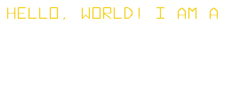

  
  
  
  
  
  
  
  
  
  
  
  
  
  
  <!-- Tailwind CSS -->
  
  
  <!-- Bootstrap -->
  
  
  <!-- Material UI -->
  

## Tech Stack

#### Web development

          

## Contact me

  
  
  

